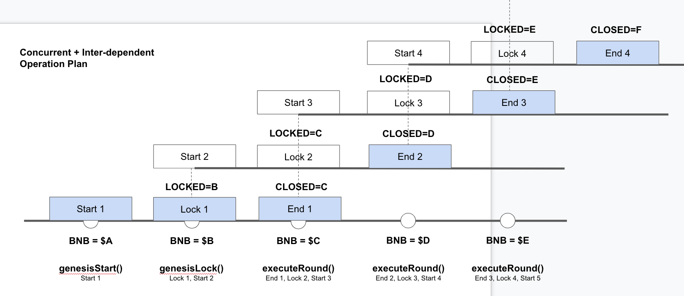
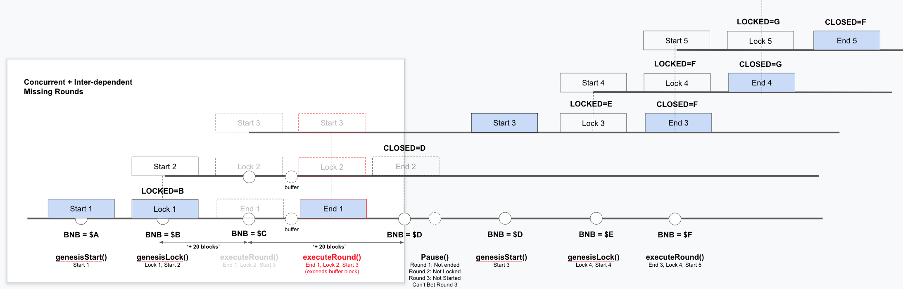

# Predictions With Pyth Oracle

## Description

Predictions with Pyth Oracle

## Documentation

## Oracle Price Feed (Pyth)

- https://docs.pyth.network/price-feeds

### ETH/USD

- Mainnet: TBA
- Testnet: TBA

## Deployment

- Get a private key from Metamask
- Create a `.env` file with the following information:
  - KEY_MAINNET=private key from Metamask
  - KEY_TESTNET=private key from Metamask

- Verify that `config.ts` has the correct information
- Run one of the following commands:
```
yarn deploy:mainnet
yarn deploy:testnet
```

### Operation

When a round is started, the round's `lockBlock` and `closeBlock` would be set.

`lockBlock` = current block + `intervalBlocks`

`closeBlock` = current block + (`intervalBlocks` * 2)

## Kick-start Rounds

The rounds are always kick-started with:

```
startGenesisRound()
(wait for x blocks)
lockGenesisRound()
(wait for x blocks)
executeRound()
```

## Continue Running Rounds

```
executeRound()
(wait for x blocks)
executeRound()
(wait for x blocks)
```

## Resuming Rounds

After errors like missing `executeRound()` etc.

```
pause()
(Users can't bet, but still is able to withdraw)
unpause()
startGenesisRound()
(wait for x blocks)
lockGenesisRound()
(wait for x blocks)
executeRound()
```

## Common Errors

Refer to `test/prediction.test.js`

## Architecture Illustration

### Normal Operation



### Missing Round Operation


